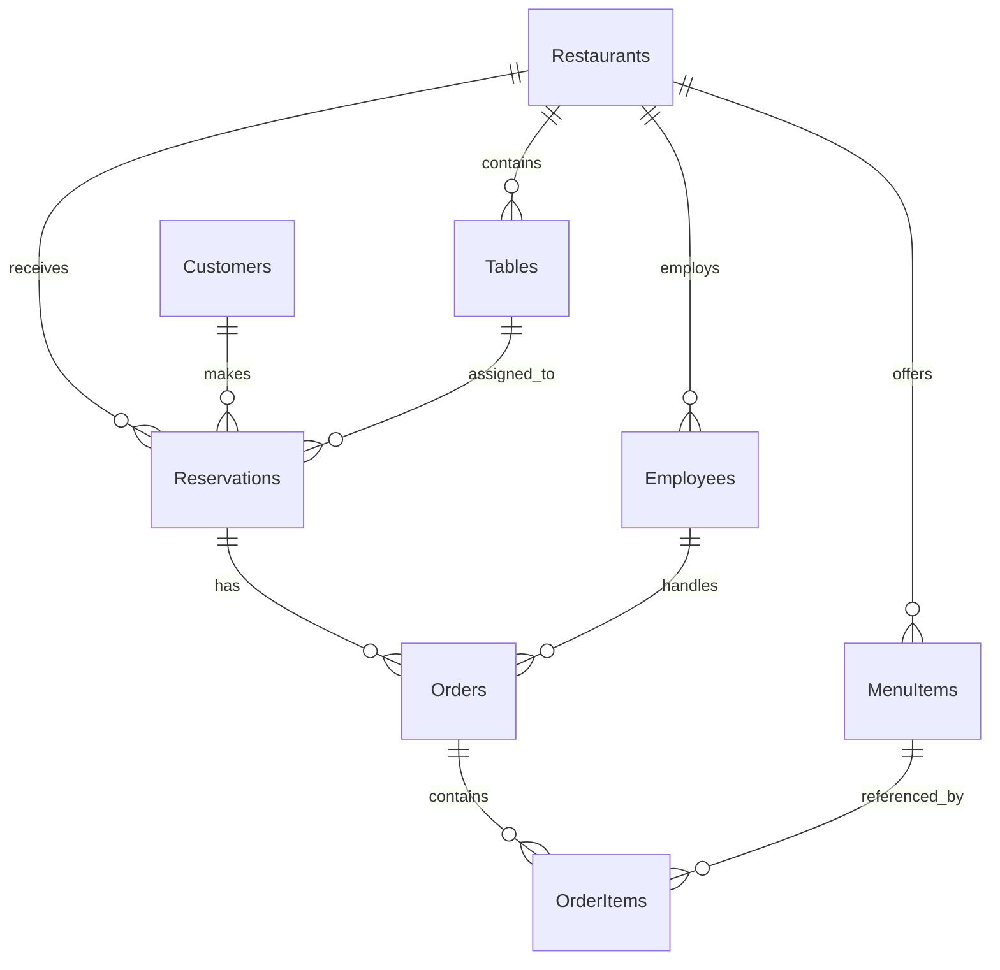

# Schema guide

## What comes directly from the exercise

The [supplied diagram](exercise-schema.png) has eight tables. It specifies their columns, primary keys, and foreign-key relationships. It does not specify SQL types, string limits, nullability, unique indexes, cascade behavior, time zones, or a reservation duration. The choices below are proposed defaults for this exercise, not additional instructions taken from the image.

Map C# PascalCase properties to the diagram's exact SQL table names and snake_case column names in schema `dbo`. Use C# `RestaurantTable` for the physical dining-table entity and map it to SQL `[Tables]`.

## Column dictionary

Proposed shared conventions: primary keys are `int IDENTITY`; foreign keys are required `int`; money uses C# `decimal` / SQL `decimal(18,2)`; date-time values use `DateTime` / `datetime2` with an application-wide UTC convention. All columns are required except MenuItems.description. Trim text input and reject empty required text. Keep phone numbers as strings, including leading zeroes and `+`.

| SQL table / C# entity | SQL columns → C# property and proposed SQL type |
| --- | --- |
| Customers / Customer | `customer_id` → `CustomerId` int PK; `first_name` → `FirstName` nvarchar(80); `last_name` → `LastName` nvarchar(80); `email` → `Email` nvarchar(254); `phone_number` → `PhoneNumber` nvarchar(30) |
| Restaurants / Restaurant | `restaurant_id` → `RestaurantId` int PK; `name` → `Name` nvarchar(120); `address` → `Address` nvarchar(250); `phone_number` → `PhoneNumber` nvarchar(30); `opening_hours` → `OpeningHours` nvarchar(200) |
| Tables / RestaurantTable | `table_id` → `TableId` int PK; `restaurant_id` → `RestaurantId` int FK; `capacity` → `Capacity` int |
| Employees / Employee | `employee_id` → `EmployeeId` int PK; `restaurant_id` → `RestaurantId` int FK; `first_name` → `FirstName` nvarchar(80); `last_name` → `LastName` nvarchar(80); `position` → `Position` nvarchar(50) |
| MenuItems / MenuItem | `item_id` → `ItemId` int PK; `restaurant_id` → `RestaurantId` int FK; `name` → `Name` nvarchar(120); `description` → `Description` nvarchar(1000) NULL; `price` → `Price` decimal(18,2) |
| Reservations / Reservation | `reservation_id` → `ReservationId` int PK; `customer_id` → `CustomerId` int FK; `restaurant_id` → `RestaurantId` int FK; `table_id` → `TableId` int FK; `reservation_date` → `ReservationDate` datetime2; `party_size` → `PartySize` int |
| Orders / Order | `order_id` → `OrderId` int PK; `reservation_id` → `ReservationId` int FK; `employee_id` → `EmployeeId` int FK; `order_date` → `OrderDate` datetime2; `total_amount` → `TotalAmount` decimal(18,2) |
| OrderItems / OrderItem | `order_item_id` → `OrderItemId` int PK; `order_id` → `OrderId` int FK; `item_id` → `ItemId` int FK; `quantity` → `Quantity` int |

`OpeningHours` is display text because the diagram supplies one field, not a scheduling model. `Position` is text; seed values include exactly `Manager`. Do not import the older project's employee-position enum.

## Relationships and navigations

Every child has exactly one required parent for each relationship; a parent can have zero or many children. Initialize collection navigations. Configure the relationships explicitly in Fluent API.

| Parent collection navigation | Child reference navigation | Foreign key |
| --- | --- | --- |
| Restaurant.Tables | RestaurantTable.Restaurant | Tables.restaurant_id |
| Restaurant.Employees | Employee.Restaurant | Employees.restaurant_id |
| Restaurant.MenuItems | MenuItem.Restaurant | MenuItems.restaurant_id |
| Restaurant.Reservations | Reservation.Restaurant | Reservations.restaurant_id |
| Customer.Reservations | Reservation.Customer | Reservations.customer_id |
| RestaurantTable.Reservations | Reservation.Table | Reservations.table_id, plus restaurant_id consistency below |
| Reservation.Orders | Order.Reservation | Orders.reservation_id |
| Employee.Orders | Order.Employee | Orders.employee_id |
| Order.OrderItems | OrderItem.Order | OrderItems.order_id |
| MenuItem.OrderItems | OrderItem.MenuItem | OrderItems.item_id |

Orders and MenuItems form a many-to-many relationship through the explicit OrderItem entity. Keep its ID and Quantity; a hidden EF join table would lose required information.

Read the main path as: a customer reserves a table at a restaurant, an employee handles an order for that reservation, and the order's lines identify menu items and quantities.

## Proposed integrity rules

### Database-enforced

- PK/FK constraints and explicit requiredness for the columns above.
- Checks: capacity > 0; party_size > 0; quantity > 0; price >= 0; total_amount >= 0. Zero money values allow a complimentary item/order.
- Unique customer email: trim input and explicitly use a case-insensitive SQL Server collation on Email for predictable uniqueness.
- Unique reservation `(table_id, reservation_date)` to prevent the exact same table/start-time pair being booked twice. This does not detect overlapping reservations: the diagram has no duration/end-time field.
- Alternate key `(table_id, restaurant_id)` on Tables and a composite reservation FK referencing it. This guarantees that the reserved table belongs to the recorded restaurant without adding a column.
- Use `DeleteBehavior.NoAction` on every relationship. Deleting a referenced parent is rejected; demo cleanup deletes children first. This avoids accidental history deletion and SQL Server multiple-cascade-path problems.
- Retain EF's FK indexes and the indexes required by these constraints. Additional performance tuning is outside this exercise.

### Library validation

- Party size must not exceed the selected table's capacity.
- An order's employee must belong to its reservation's restaurant.
- An order line's menu item must belong to its order's reservation's restaurant.
- Apply these rules on both create and update. An update of a referenced reservation, employee, menu item, table, or order must also account for its existing dependents. Reject restaurant reassignment while dependent records exist; reject a capacity reduction below the party size of any referencing reservation.
- These cross-table checks belong in the library for this single-user console exercise. They are not SQL CHECK constraints and do not protect arbitrary SQL writes or all concurrent-write races. A multi-user production system would need a separate concurrency design.

### Important scope choices

- The diagram has no `unit_price`, payment status, discount, tax, table number, or audit table. Do not silently add them.
- Treat `Orders.total_amount` as the recorded order amount and use it for both revenue and employee averages. The CRUD method accepts this recorded nonnegative value. Seed totals match quantities × seeded prices, but do not retrospectively recalculate recorded totals when menu prices change.
- Because the diagram has no historical line price, it cannot reconstruct an old total from current menu prices reliably. A unit-price snapshot would be a separate schema extension, outside the supplied exercise.
- Permit an order without lines while demonstrating separate CRUD operations. Detailed-order queries should still return it with an empty line collection.
- Permit repeated menu items in separate OrderItems rows; no unique `(order_id, item_id)` rule is assumed. The “ordered menu items” query returns unique menu items across all lines/orders for that reservation.
- No rule banning past reservations is assumed. Historical records are necessary for reporting.

## Read models and SQL objects

| Database object | Library result | Required meaning |
| --- | --- | --- |
| `dbo.vw_ReservationDetails` | Keyless `ReservationDetails` | One row per reservation with its fields, customer name/contact, restaurant name/address |
| `dbo.vw_EmployeeRestaurantDetails` | Keyless `EmployeeRestaurantDetails` | One row per employee with employee fields and restaurant name/address |
| `dbo.CalculateRestaurantRevenue` | `decimal` via async library wrapper | Sum each order total once for a restaurant; 0 for no orders or an unknown ID |
| `dbo.GetCustomersByMinimumPartySize` | `Customer` read results | Distinct customers having at least one reservation with party_size strictly greater than the parameter |

Map view models with `HasNoKey().ToView(...)`; create/drop views explicitly in migrations. Include all columns needed by the result type with matching aliases. Use `AsNoTracking` for entity reads that will not be changed. See [Microsoft's keyless entity guidance](https://learn.microsoft.com/en-us/ef/core/modeling/keyless-entity-types).

The mapped scalar function is a SQL translation target; its CLR stub is not itself an asynchronous database call. An async wrapper must execute a translated query, or a parameterized scalar SQL query, and return the value. See [function mapping](https://learn.microsoft.com/en-us/ef/core/querying/user-defined-function-mapping).

SQL Server cannot compose a LINQ query over a stored-procedure `EXEC`. Execute a parameterized `FromSql`/`FromSqlInterpolated` call, then materialize with `ToListAsync` before applying any client-side sort. Return all mapped Customer columns if materializing Customer entities. See [SQL query guidance](https://learn.microsoft.com/en-us/ef/core/querying/sql-queries).

Use separate migration SQL commands for each `CREATE VIEW`, `CREATE FUNCTION`, and `CREATE PROCEDURE`; do not embed SSMS `GO` separators in migration SQL. Each `Down` removes its corresponding object before dependent tables could be dropped.
